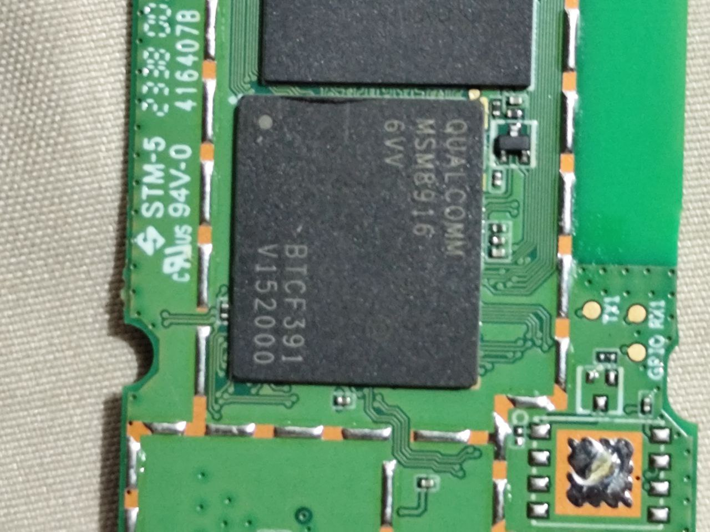

# HMUF02-VO5

## Introduction

A few months after getting the other 4G LTE stick, which you can refer to [here](https://github.com/AlienWolfX/UZ801-USB_MODEM), I found this other 4G LTE stick. My first thought was that it had a different processor than my other 4G LTE stick, but it turns out that they both have the same processor, the `Qualcomm MSM8916`. Though they have the same processor, they both have different features. Below are some pictures of it's hardware

|   |    |
| ---------------------- | ---------------------- |
|  |  |
|  |  |
|  |  |

Based on my research with this device, you can use WLAN Hotspot and USB tethering, as proven by the following pictures:

|  |  |
| ------------------------------ | ------------------------- |

> [!NOTE]  
> Bluetooth can be toggled, but it doesn't work.

## Firmware Dump and Restore

Before making any modifications to your device, such as rooting, it's crucial to first back up its firmware. You'll need this [tool](ttps://github.com/bkerler/edl) to execute the commands below.

Note: To enable EDL mode on your device, **press the reset button** while plugging the USB modem into your PC. If the LEDs do not light up, execute the following commands.:

To backup:

`python3 edl rf {your_filename}.bin`

To restore simply run:

`python3 edl wf {your_filename}.bin`

## Getting Root

Rooting the device is straightforward. By default, it comes with SuperSU, which you will need to grant access to when requesting for a root shell via adb using ARDC or adbcontrol.

## License

This repository is open-sourced software licensed under the [MIT license](https://opensource.org/licenses/MIT).
